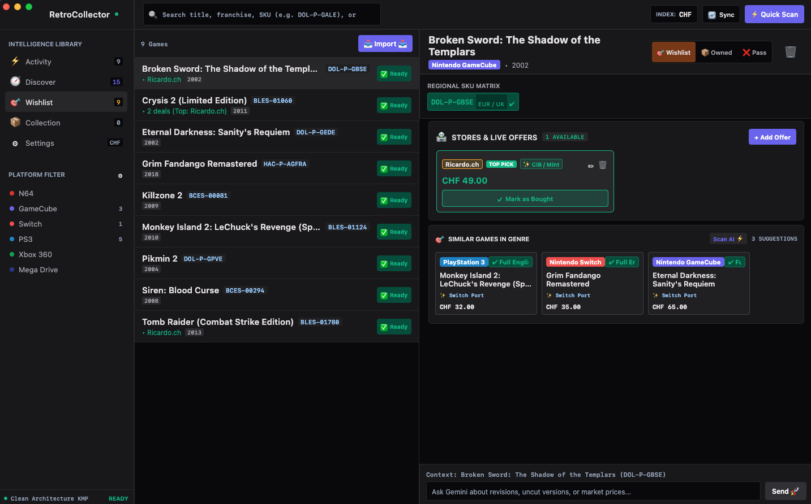
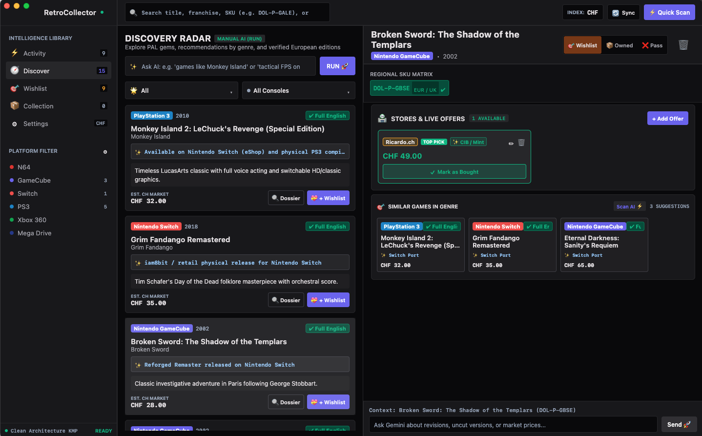
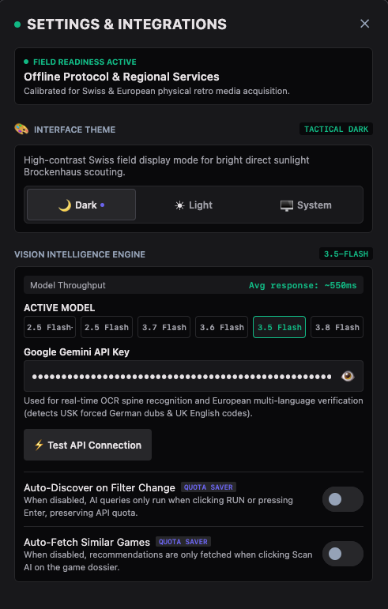

# RetroCollector — Game Language & Edition Tracker (CH / PAL) 🎮

A multiplatform app built with **Kotlin Multiplatform (Compose Multiplatform)** for retro game collectors buying physical games in **Switzerland** or the broader European (PAL) market.

Covers **30 consoles across 5 ecosystems** — Nintendo, PlayStation, Xbox, Sega, and Retro Vintage — from the NES and Mega Drive all the way to Switch 2 and PS5. Solves the classic second-hand regional release problem in the Swiss market (Ricardo.ch, Tutti.ch, flea markets), where many physical GameCube and PS3 copies are German USK editions locked to German-only audio. The app identifies safe editions with **full English audio and text** by analysing the serial code on the spine or disc.

---

## 🖥️ App Highlights & Screenshots (macOS Desktop)

### 🎯 Wishlist & Game Dossier
*Master-detail workstation layout with multi-console filtering, regional SKU matrix (`DOL-P-GBSE EUR/UK`), live marketplace store offers (Ricardo.ch), similar games in genre, and interactive Gemini chat.*



---

### 📡 Discovery Radar
*Explore PAL gems and search using natural language (e.g. "games like Monkey Island" or "tactical FPS on PS3") with remaster alerts and instant wishlist triage.*



---

### ⚙️ Settings & Intelligence Engine
*Dark / Light / System interface theme toggle, Multi-AI Provider selector (Google Gemini, Anthropic Claude, OpenAI / OpenRouter, Local Ollama), API key and live connection tester, Marketplace Scraper Proxy (Scrape.do & Custom curl-cffi proxy with Residential `super=true` toggle), and Quota Saver controls.*

<p align="center">
  
</p>

---

## 🚀 Key Features

* **🛡️ PAL Language Safety Verifier**: Distinguishes guaranteed English editions (UKV/PEGI) from German-locked USK copies (`DOL-P-xxxx-(NOE)`, `BLES-00351`, etc.) to prevent unplayable purchases.
* **🏷️ Tracked Marketplace Offers**: Track multiple listings across Ricardo.ch, Tutti.ch, and Anibis.ch with condition (`CIB`, `BOXED`, `LOOSE`), shipping costs, and lowest landed price calculation.
* **⚡ Cloudflare-Bypassing Scraper Proxy**: Extracts live listings, high-resolution photos, and CHF pricing using **Scrape.do API** (with JS rendering & residential proxy support) or a **Custom / Self-Hosted `curl-cffi` proxy microservice**.
* **🇨🇭 Swiss Market Radar**: Tracks median asking prices, historical min/max CHF ranges, and market pricing trends in Switzerland.
* **🧠 Multi-AI Discovery & Intelligence Engine**: Multimodal spine OCR, curated catalog exploration, similarity recommendations based on owned games, and persistent contextual chat per title across multiple AI providers (Gemini, Claude, OpenAI/OpenRouter, Local Ollama).
* **☁️ Structured Firestore Sync**: Real-time multiplatform synchronization for your collection, wishlist, marketplace offers, and chat history.
* **🌓 Adaptive Material 3 Theming**: Dark and Light tactile themes with high-contrast retro accents.

---

## 🚀 Supported Platforms (3-in-1 Shared Codebase)

1. **📱 Android (`:androidApp`)**
   - Install the debug APK directly: `composeApp/build/outputs/apk/debug/composeApp-debug.apk`
   - Integrated with the Android Share menu (`ACTION_SEND`): share a Ricardo.ch or Tutti.ch listing directly into the app.

2. **💻 Desktop macOS (`:desktopApp`)**
   - UberJar built at: `composeApp/build/compose/jars/RetroCollector-macos-x64-1.0.0.jar`
   - Run with: `./gradlew :composeApp:run`

3. **🌐 WebAssembly (Wasm) & Docker on Synology NAS (`:wasmJs`)**
   - High-performance Wasm build via Skiko / Canvas.
   - Ready-to-use Docker setup for Synology Container Manager in `docker/docker-compose.yml` and `docker/nginx.conf`.

---

## 🛠️ Tech Stack

* **Kotlin 2.0 & Compose Multiplatform 1.6.11**
* **Material 3 Adaptive** (dark retro gaming theme, high contrast)
* **Google Gemini Flash API** (multimodal vision, spine serial OCR, PAL-specialised prompts)
* **Firebase Cloud Firestore** (real-time game and chat sync across devices)
* **Marketplace Proxy Scraper** (Scrape.do API & custom `curl-cffi` TLS/JA3 impersonation proxy)
* **Ktor Client 3.0** (multiplatform REST calls, image streaming, and proxy communication)
* **Kotlinx Serialization & Coroutines**

---

## 📦 Getting Started

### 1. macOS Desktop

Run the native window app:
```bash
./gradlew :composeApp:run
```
Or run the JAR directly:
```bash
java -jar "composeApp/build/compose/jars/RetroCollector-macos-x64-1.0.0.jar"
```

### 2. Android

Install the debug APK via adb:
```bash
adb install -r "composeApp/build/outputs/apk/debug/composeApp-debug.apk"
```
Or open this project in **Android Studio** and select the `composeApp` run target for your device or emulator.

### 3. Synology NAS (Docker)

The `docker/` folder contains everything needed to serve the WebAssembly build:

1. Build the Wasm distribution on your Mac:
   ```bash
   ./gradlew :composeApp:wasmJsBrowserDistribution
   ```
2. Copy the generated `dist` folder to your Synology.
3. Start the container in **Synology Container Manager**:
   ```bash
   docker-compose up -d
   ```
4. Access the tracker at `http://<YOUR_SYNOLOGY_IP>:8085`.

---

## 🔑 API Keys & Integrations Setup

In the app, tap the gear icon **⚙️ Settings**:

### 1. 🧠 AI Provider Setup

RetroCollector supports multiple AI engines for OCR spine analysis, PAL edition verification, game discovery, and interactive collector chat.

> ⚠️ **Testing & Verification Notice:**
> While full architecture, network clients, JSON extraction parsers, and unit tests have been implemented for all supported providers (Claude, OpenAI/OpenRouter, Local Ollama), **only Google Gemini has been extensively field-tested and battle-tested end-to-end** with live multimodal OCR on real Swiss market physical listings. If you choose another provider, ensure the chosen model supports multimodal vision input and JSON structured outputs.

* **🟢 Google Gemini (Recommended & Fully Tested)**
  - **Models:** `gemini-3.8-flash` (Default), `gemini-3.6-flash`, `gemini-3.7-flash`, `gemini-3.5-flash`, `gemini-2.5-flash`, `gemini-2.5-flash-lite`.
  - **Setup:** Generate a free API key at [Google AI Studio](https://aistudio.google.com/), select the **Gemini** tab in Settings, paste your key, and click **Test Connection**.

* **🟣 Anthropic Claude (Experimental / Architecture Tested)**
  - **Models:** `claude-3-7-sonnet-20250219`, `claude-3-5-sonnet-20241022`, `claude-3-5-haiku-20241022`.
  - **Setup:** Generate an API key from the [Anthropic Console](https://console.anthropic.com/), select the **Claude** tab in Settings, paste your key (`sk-ant-...`), and click **Test Connection**.

* **🔵 OpenAI / OpenRouter / Custom Compatible APIs (Experimental / Architecture Tested)**
  - **Models:** `gpt-4o`, `gpt-4o-mini`, `o3-mini`, `deepseek-chat`, or any custom model.
  - **Setup:** Select the **OpenAI** tab in Settings. Enter your API key and set the Base URL:
    - **OpenAI:** `https://api.openai.com/v1`
    - **OpenRouter:** `https://openrouter.ai/api/v1`
    - **Custom Compatible Gateway:** e.g., `https://your-custom-gateway.com/v1`

* **🏠 Local Ollama / LM Studio (Experimental / Architecture Tested)**
  - **Models:** `llama3.2-vision`, `llava`, `qwen2.5`, etc.
  - **Setup:** Run Ollama locally (e.g., `ollama run llama3.2-vision`). In Settings under the **Local Ollama** tab, set your server URL (default: `http://localhost:11434/v1`). No API key is required. Provides 100% offline, private OCR and intelligence.

---

### 2. 🌐 Marketplace Scraper Proxy (Ricardo.ch, Tutti.ch, Anibis.ch)
- **Option A: Scrape.do API (Recommended for zero maintenance)**
  - Create a free account at [Scrape.do](https://scrape.do/) (1,000 free requests/month).
  - Paste your API Token in Settings.
  - Toggle **Residential Proxy (`super=true`)** if you encounter stubborn captchas (uses 25 credits/req instead of 5 credits/req).
- **Option B: Custom / Self-Hosted Proxy (Unlimited / Free)**
  - Select **Custom Proxy** and enter the endpoint URL of your self-hosted scraper microservice (e.g., `https://my-scraper.fly.dev/scrape?url=`).

---

### 3. ☁️ Firebase Firestore Sync
- Create a free project at the [Firebase Console](https://console.firebase.google.com/).
- Enable **Cloud Firestore** in test mode or with read/write rules.
- Enter your **Firebase Project ID** in Settings.
> ⚠️ **Security note:** Test mode leaves the database publicly readable and writable. This is fine for personal use in a controlled environment, but configure proper [Firestore Security Rules](https://firebase.google.com/docs/firestore/security/get-started) (see [`firestore.md`](firestore.md)) before sharing your Project ID or using in production.

---

## 🔍 How Language Detection Works

The app uses a system prompt specialised in European PAL market quirks:

* **PS3**: Identifies `BLES-xxxxx` codes on the spine. Flags USK/DACH region codes that lack English audio (e.g. *Fallout 3 BLES-00561*) and suggests the UK version (*BLES-00344*).
* **GameCube**: Distinguishes between `DOL-P-xxxx-(NOE)` (often German-only) and `DOL-P-xxxx-(UKV/EUR)` (multi-5 or guaranteed English).
* **N64**: Maps European `NUS-xxxx-EUR` cartridges.
* **Switch**: Validates whether the European cartridge includes English audio.
* **Contextual Chat**: Every game or franchise keeps its own conversation history so you can ask follow-up questions at any time.

---

## ⚖️ Legal Disclaimer

The listing reader feature fetches publicly accessible pages from Ricardo.ch, Tutti.ch, Anibis.ch, and eBay to extract metadata from links shared by the user. This is provided for **personal convenience and educational purposes only**. Users are **solely responsible** for complying with each platform's Terms of Service. The author does not encourage or endorse any use that violates those terms.

---

## 📜 License

This project is licensed under the **MIT License** — see the [LICENSE](LICENSE) file for details.
